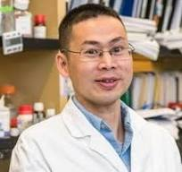

<!-- README.md is generated from README.Rmd. Please edit that file -->
# Tang Lab @ UVA

Shangming Tang, PhD

Assistant Professor of Biochemistry and Molecular Genetics, Biochemistry
and Molecular Genetics

<i class="fa fa-envelope"></i>Website:
<a href="https://github.com/SMTangLab/UVA/">https://github.com/SMTangLab/UVA/</a>

<i class="fa fa-envelope"></i>Email:
<a href="mailto:gvu7pk@virginia.edu">gvu7pk@virginia.edu</a>

# Research Interests

Complex Genome Rearrangements

# Research Description

The Tang laboratory applies a wide range of approaches such as live-cell
imaging, single-cell genomics, and biochemistry to study the mechanisms
of complex genome rearrangements in cancers, developmental disorders,
and other human diseases.

Genome instability, characterized by both DNA mutations and chromosomal
rearrangements, is a hallmark of cancer. In contrast to classical models
that propose these mutational processes occur gradually, recent studies
have identified catastrophic mutational phenomenon that extensively
alter the genome “all-at-once”. One such process is termed
chromothripsis. Chromothripsis is characterized by massive chromosomal
rearrangements on one or a few chromosomes within a single cell cycle.
Comprehensive genomic analysis indicates that chromothripsis is
prevalent across cancer types and can cause human developmental
disorders.

Chromothripsis was recently shown to occur in abnormal nuclear
structures called micronuclei, but how DNA contained in micronuclei
underwent breakage remained unknown. We demonstrated that aberrant
processing of transcriptional intermediates in micronuclei leads to DNA
break formation in micronuclei, and likely contributes to
chromothripsis. We continue to be interested in dissecting the molecular
mechanism of how DNA breaks are formed in micronuclei, how they are
processed, and their contribution to genome instability.

We are also more broadly interested in DNA damage from transcriptional
intermediates. R-loops, composed of DNA paired with RNA as well as a
displaced DNA strand, have been shown to be involved in many important
physiological functions, including regulating transcription,
immunoglobulin genes rearrangement, mitochondria DNA replication.
However, the aberrant accumulation of R-loops can also lead to DNA
damage and genome instability. Therefore, another interest of the lab is
to study the regulation of R-loop formation, resolution, and its
function in different cellular contexts, particularly focused on the
roles of R-loops in DNA damage and repair in somatic and meiotic cells.
